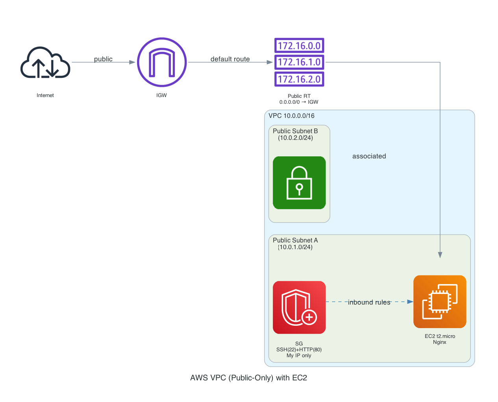

# Terraform AWS VPC + EC2 (Public-Only, Free-Tier Safe)

This repo creates a minimal, **free-tier friendly** AWS network and a single EC2 instance with Nginx pre-installed. It’s designed for learning: simple, safe defaults, and easy to destroy.

---

## What it builds
- VPC: `10.0.0.0/16`
- 2 public subnets across AZs
- Internet Gateway + public route table
- Security group allowing **SSH (22)** and **HTTP (80)** from **my current IP only**
- 1 x `t2.micro` Amazon Linux 2 EC2 running Nginx



---

## Why public-only?
To avoid NAT Gateway charges while learning. NAT Gateways cost money per hour + data. This setup keeps costs ~£0 on free tier.

---

## Prereqs
- AWS account (with budget alerts configured!)
- AWS CLI configured (`aws configure`)
- Terraform >= 1.5 installed
- SSH key at `~/.ssh/id_rsa.pub` (or update the path in `main.tf`)

---

## Usage (with Makefile)

This project comes with a simple **Makefile** to automate common Terraform commands.

```bash
# 1. Initialise providers
make init

# 2. Format & validate code
make fmt
make validate

# 3. See what Terraform will create
make plan

# 4. Apply changes (provision infra)
make apply

# 5. Destroy everything (clean up resources)
make destroy

# 6. Run pre-flight checks (formatting + validate)
make check
